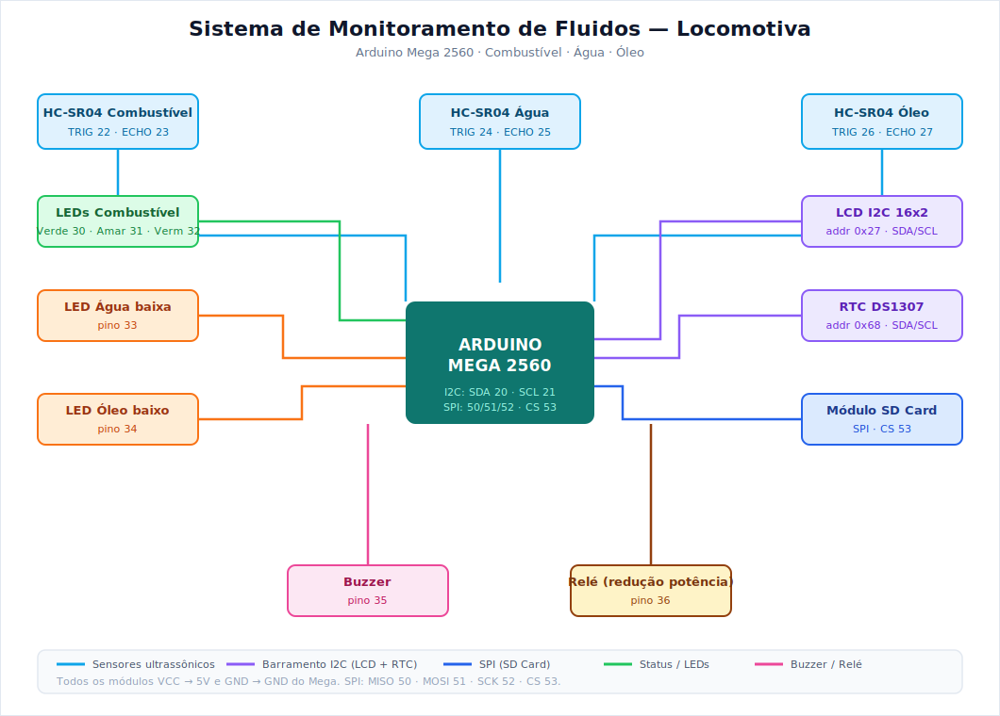

# Sistema de Monitoramento de Fluidos para Locomotiva

Sistema embarcado baseado em **Arduino Mega 2560** que monitora em tempo real os níveis de **combustível, água e óleo** de uma locomotiva, exibe os dados em display LCD, alerta condições críticas por LED e buzzer, aciona um relé de redução de potência quando o combustível está crítico e registra o histórico de consumo com data e hora em cartão SD.

> Projeto desenvolvido no curso **Técnico em Desenvolvimento de Sistemas — SENAI Feira de Santana**.



---

## Sumário

- [Funcionalidades](#funcionalidades)
- [Hardware necessário](#hardware-necessário)
- [Esquema de ligações](#esquema-de-ligações)
- [Bibliotecas](#bibliotecas)
- [Como compilar e enviar](#como-compilar-e-enviar)
- [Como simular no Wokwi](#como-simular-no-wokwi)
- [Lógica de funcionamento](#lógica-de-funcionamento)
- [Formato do histórico no SD](#formato-do-histórico-no-sd)
- [Estrutura do repositório](#estrutura-do-repositório)
- [Melhorias futuras](#melhorias-futuras)
- [Licença](#licença)

---

## Funcionalidades

- **Medição de nível** dos três tanques por sensores ultrassônicos, com média de 10 leituras e descarte de leituras inválidas (sensor desconectado não é lido como "tanque cheio").
- **Display LCD I2C 16x2** mostrando os três níveis em porcentagem.
- **Alarme de combustível** por três LEDs (verde / amarelo / vermelho) indicando a criticidade.
- **Acionamento de relé** para modo de redução de potência quando o combustível fica abaixo de 30%.
- **Alarme de manutenção** (LED + mensagem + beep) para água ou óleo abaixo de 80%.
- **Prioridade de alarme no LCD**: apenas a condição mais crítica é exibida por ciclo, evitando que mensagens se sobreponham.
- **Registro em cartão SD** com data, hora e níveis a cada 10 segundos, usando o RTC DS1307.
- **Buzzer** para alertas sonoros.

## Hardware necessário

| Componente | Quantidade |
|---|---|
| Arduino Mega 2560 | 1 |
| Sensor ultrassônico HC-SR04 | 3 |
| Display LCD 16x2 com módulo I2C | 1 |
| Módulo RTC DS1307 | 1 |
| Módulo leitor de cartão microSD | 1 |
| LED verde, amarelo e vermelho (combustível) | 3 |
| LED de alerta de manutenção (água, óleo) | 2 |
| Resistores 220 Ω (para os LEDs) | 5 |
| Buzzer | 1 |
| Módulo relé | 1 |
| Protoboard, jumpers e fonte 5V | — |

## Esquema de ligações

**Sensores ultrassônicos**

| Tanque | TRIG | ECHO |
|---|---|---|
| Combustível | 22 | 23 |
| Água | 24 | 25 |
| Óleo | 26 | 27 |

**LEDs de combustível**

| LED | Pino |
|---|---|
| Verde | 30 |
| Amarelo | 31 |
| Vermelho | 32 |

**LEDs de manutenção**

| Função | Pino |
|---|---|
| Água baixa | 33 |
| Óleo baixo | 34 |

**Outros componentes**

| Componente | Pino |
|---|---|
| Buzzer | 35 |
| Relé | 36 |
| SD (CS) | 53 |
| SD (MOSI / MISO / SCK) | 51 / 50 / 52 |
| LCD I2C | SDA 20 / SCL 21 |
| RTC DS1307 | SDA 20 / SCL 21 |

Todos os módulos recebem **VCC em 5V** e **GND** no Arduino. O diagrama completo está em [`docs/diagrama_eletrico.svg`](docs/diagrama_eletrico.svg).

## Bibliotecas

Instale pelo Gerenciador de Bibliotecas da Arduino IDE:

- `LiquidCrystal_I2C`
- `RTClib` (Adafruit)
- `SD` (já incluída na IDE)
- `Wire` e `SPI` (já incluídas na IDE)

## Como compilar e enviar

1. Abra `src/monitor_locomotiva.ino` na Arduino IDE.
2. Instale as bibliotecas listadas acima.
3. Selecione a placa **Arduino Mega or Mega 2560** e a porta correta.
4. Monte o circuito conforme o esquema de ligações.
5. Faça o upload.

Na primeira execução, se o RTC nunca foi acertado (ou perdeu a bateria), o código ajusta automaticamente a data/hora para o momento da compilação.

## Como simular no Wokwi

O projeto inteiro roda no [Wokwi](https://wokwi.com), que suporta o Arduino Mega, o HC-SR04, o LCD I2C, o DS1307 e o módulo microSD. É assim que você gera a imagem da montagem em simulação.

1. Crie um novo projeto **Arduino Mega** em [wokwi.com](https://wokwi.com).
2. Cole o conteúdo de `src/monitor_locomotiva.ino` na aba `sketch.ino`.
3. Substitua o conteúdo da aba `diagram.json` pelo arquivo [`simulacao/diagram.json`](simulacao/diagram.json) deste repositório.
4. Na aba **Library Manager**, adicione `LiquidCrystal I2C` e `RTClib`.
5. Clique em ▶ para iniciar. O cartão SD aparece como uma aba **SD Card**, onde você pode ver o `historic.txt` sendo gravado.
6. Com a simulação rodando, tire um print da tela e salve em `docs/simulacao.png`.

> Dica: no módulo SD do Wokwi os pinos de dados se chamam **DI** (= MOSI, pino 51) e **DO** (= MISO, pino 50); SCK vai no 52 e CS no 53.

## Lógica de funcionamento

**Combustível** (LEDs + relé):

| Nível | LED | Ação |
|---|---|---|
| acima de 60% | Verde | normal |
| 30% a 60% | Amarelo | exibe "ATENCAO" |
| abaixo de 30% | Vermelho | alarme + aciona relé (redução de potência) |

**Água e óleo:** abaixo de 80%, acende o LED de manutenção, mostra a mensagem no LCD e emite um beep.

**Prioridade de exibição no LCD** (uma tela e um beep por ciclo): erro de sensor → combustível crítico → manutenção (água/óleo) → tela normal de níveis.

Os sensores são lidos assumindo montagem no **topo do tanque**: quanto mais cheio, menor a distância medida. As alturas dos tanques são configuráveis no início do código (`alturaTanqueComb`, `alturaTanqueAgua`, `alturaTanqueOleo`).

A polaridade do relé é configurável pela constante `RELE_ATIVO_BAIXO` — muitos módulos relé de Arduino são acionados em nível baixo.

## Formato do histórico no SD

O arquivo `historic.txt` recebe uma linha a cada 10 segundos:

```
31/05/2026 14:30:05 | Comb: 72.4% | Agua: 88.1% | Oleo: 91.0%
31/05/2026 14:30:15 | Comb: 71.9% | Agua: 88.0% | Oleo: 90.8%
```

Se um sensor falhar, o campo correspondente é gravado como `ERRO` em vez de uma porcentagem falsa.

## Estrutura do repositório

```
monitoramento-locomotiva/
├── README.md
├── LICENSE
├── src/
│   └── monitor_locomotiva.ino
├── docs/
│   ├── diagrama_eletrico.svg
│   └── simulacao.png          (print que você gera no Wokwi)
└── simulacao/
    └── diagram.json           (montagem para o Wokwi)
```

## Melhorias futuras

- Substituir os `delay()` por temporização não bloqueante com `millis()`.
- Calibração individual de cada sensor.
- Envio dos dados por rede (Wi-Fi/GSM) para monitoramento remoto.

## Licença

Distribuído sob a licença MIT. Veja o arquivo [`LICENSE`](LICENSE).

## Autor

Carlos — Técnico em Desenvolvimento de Sistemas, SENAI Feira de Santana.
